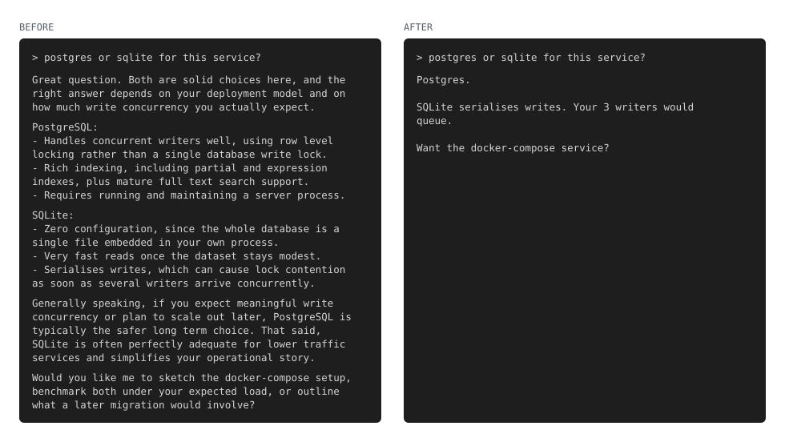

# Dyslexic Claude

A Claude Code output style for people who find reading expensive.
Same technical depth, far less text. The answer lands in sentence 1, and you get 1 ranked
recommendation instead of a menu of options.




## Install

```bash
claude marketplace add https://github.com/schananas/dyslexic-claude
claude plugin install dyslexic-claude@dyslexic-claude
```

Restart Claude Code or run `/clear` for it to take effect. It applies automatically
because the style sets `force-for-plugin: true`. Disable it with `/plugin`.

## What changes

- No preamble, no restating your question.
- Short blocks, numbered steps and bold anchors. You re-enter the text after losing focus,
  without rereading.
- No nested lists.
- Code blocks stay untouched. Nothing is elided.

Correctness does not change. A 400 word answer stays 400 words if the content needs it.
Wrong-but-short is the worst outcome.

## Why dyslexia and ADHD are the reference reader

They are the strictest reading budget, not a niche case. Design for the reader with the
least slack and everyone gains. Same as the curb cut: built for wheelchairs, used by
everyone with a suitcase.

They push the text in 2 different directions.

- Dyslexia costs per word. Cost grows with word count, word length and word rarity.
- ADHD, short for attention deficit hyperactivity disorder, costs per open item. Cost
  grows with unresolved options, structure depth and questions you hold in mind.

"Be concise" prompts only fix the first cost. They cut words, then hand you 5 unranked
options in a nested list. Shorter text, more decisions, no gain.

The 2 conditions often occur together, so this reader is real, not a composite.

## What the rules are based on

Each rule traces back to a finding about reading or attention, not to taste.

| Rule | Why |
|---|---|
| Bold for emphasis, never italics, underline or all caps | Dyslexia style guidance treats italics and underline as distorting word shape. Bold keeps the shape intact. |
| Everyday words over rare synonyms | Eye-tracking shows rare words draw longer fixations. Rarity, not just length, is the cost. |
| Same concept, same word, every time | A repeated word is primed and reads faster. Elegant variation makes you re-decode a known idea. |
| Short blocks, headings, numbered steps | Anchor points mean losing your place costs a glance instead of a reread. |
| One idea per sentence, active voice | Long dependencies between words load working memory, the documented weak point in ADHD. |
| One ranked recommendation, no menus | Every unranked option is an item held open. Ranking closes them. |
| No nested lists | Depth makes you track where you are as well as what it says. |
| Expand every abbreviation on first use | An abbreviation is a lookup, and a lookup pulls you out of the text. |
| Answer in sentence 1 | If attention runs out, it runs out after the answer instead of before it. |

Sources are the British Dyslexia Association style guidance, eye-movement research on word
frequency, cognitive load work from instructional design, and working-memory findings in
ADHD.
## What it changes in Claude

An output style is appended to Claude Code's system prompt, and Claude Code re-injects
reminders about it during the conversation. A chat message fades as context fills up. The
system prompt does not.

`keep-coding-instructions: true` keeps Claude Code's software engineering behaviour
intact. This changes how Claude writes to you, not how it writes code.

## Notes

The style is 1 Markdown file: `output-styles/dyslexic-claude.md`. Fork it and edit the
rules if your reading profile differs.

## License

MIT
